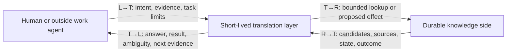

# Information flow across the knowledge boundary

This is a supporting feasibility probe for the product described in the [overview](overview.md), not the product itself. Earlier workflows hid hard work inside words such as “resolve,” “retrieve,” “interpret,” and “assemble.” T096 asked whether the internal layer could really perform those steps, whether the needed knowledge would be organized and retrievable, and what moved in both directions. T098 warned against turning that audit into the center of the project. ([T096](../source/origin-conversation-verbatim.md#t096---user), [T098](../source/origin-conversation-verbatim.md#t098---user))

The left and right labels describe a semantic boundary, not a deployment topology.

The outside agent remains capable and structure-blind. The translation layer receives one clean request, uses only knowledge-side tools, and ends. Durable memory and enforcement remain on the right. This is the topology described in [T055–T061](../source/origin-conversation-verbatim.md#t055---user).

## What each participant knows

| Participant | Knows | Does not automatically know |
| --- | --- | --- |
| Outside work agent or human | The task, what was observed or decided, available evidence, and the result wanted | Store identifiers, relation types, history mechanics, mutation shapes, or retrieval syntax |
| Translation layer | The current request, its fixed role instructions, and the bounded material returned by knowledge tools | Omitted task history, live world state, source authenticity, unseen store contents, or whether a write persisted |
| Durable knowledge side | Stored identities, material, relationships, provenance, history, and observable write outcomes | The caller's unstated meaning or whether two pieces of prose mean the same thing |

The translation layer can reason over supplied material. It cannot repair missing information by sounding confident.

## What crosses each boundary

These are scenario-derived contents, not one mandatory record shape. A request carries only what that workflow needs.

| Direction | Information that may need to cross |
| --- | --- |
| **L→T** | Plain-language intent or question; raw evidence or a durable locator; source and observation time when relevant; explicit qualifications; target hints; task scope; as-of time; desired response; risk and context limits when the request needs them. A retry also carries the prior request identity and repeated content needed for exact binding. |
| **T→R** | Identity candidates to resolve; a bounded retrieval question; requested time or task scope; a provenance drill-down; or proposed semantic effects that reference the material used to derive them. Retry and reconciliation requests also carry the operation reference, exact content binding, affected references, and the target version or current state used by the proposal. |
| **R→T** | Candidate identities and match basis; exact stored content; source and time; current, historical, conflicting, or uncertain standing; relationship paths; query limits; validation failures; and per-effect write outcomes. Retry and reconciliation results also identify the prior operation, content match or mismatch, inspected target state, and each applied, absent, or indeterminate effect. |
| **T→L** | Answer or change result; what was and was not established; exact accepted, rejected, unchanged, or indeterminate effects; useful source pointers; ambiguity; and the next evidence needed |

Normal reads should not dump all metadata. The right side must still expose enough metadata for the translation layer to judge the current request.

## Work the translation layer can do

Given bounded candidates and evidence, a small model can plausibly:

- Parse a submission into evidence, claimed meaning, qualification, and requested outcome.
- Distinguish an observation, decision, correction, question, and suggested relationship when the input supports that distinction.
- Choose among candidates when the returned distinguishers make one candidate unique.
- Compare a bounded history and propose whether new material coexists with, qualifies, conflicts with, or replaces an earlier interpretation.
- Rank task-relevant material and write a concise answer that preserves stated uncertainty.
- Propose organizational links without requiring the outside agent to know the store shape.

It cannot safely supply:

- Identity that neither the request nor the store can disambiguate.
- Provenance, observation time, caller authority, or source credibility that was never supplied.
- Proof that retrieval was complete when the store reports only some search hits.
- Current live state from an old observation.
- Idempotency, revision safety, atomicity, authorization, or persistence guarantees.
- A successful write result before the durable side reports the result.
- A safety rule or source-precedence policy that has not been explicitly stored or supplied.

Those are information, policy, or protocol responsibilities—not reasoning tasks to hide in an LLM prompt.

## What organization and retrieval must make possible

The desired store can remain sparse. Every knowledge piece does not need every field. Across the stored material and its indexes, the knowledge tools must be able to answer the questions a trace actually asks:

- What does this name or phrase probably refer to, and is the match unique?
- What was supplied exactly, from where, and when?
- Is this material an observation, decision, proposal, correction, relationship, question, or something still unresolved?
- What subject, context, operation, or other knowledge does it concern?
- What is current for the requested time, and what is only historical?
- What supports, qualifies, conflicts with, or supersedes it?
- Which source material can be inspected when the interpretation is challenged?
- Was the requested search complete, truncated, inaccessible, or limited to a particular scope?
- What changed durably, what did not, and what outcome remains unknown?

This implies several retrieval paths—identity and aliases, context and relationships, time and currentness, history and conflict, source and provenance, and task or operation. It does not decide whether those paths are implemented by a graph, relational indexes, search, or something else.

### Absence is not one thing

For a missing result, the right side must distinguish at least:

- No matching material was found in the stated search scope.
- Matching material may exist, but the result was truncated.
- The source or index was unavailable or inaccessible.
- That category was not searched.

Without that distinction, the translation layer can say only “not present in the material returned.” It cannot say “does not exist” or treat an unreturned safety constraint as satisfied.

## Feasibility exposed by the current workflows

| Workflow | Can a bounded translation model perform it? | What remains outside model reasoning |
| --- | --- | --- |
| Store an observation | Conditionally | Identity lookup, source binding, related-history retrieval, and per-effect persistence outcome |
| Retrieve task context | Plausibly, but not yet proven | Coverage of safety-critical retrieval and explicit missing-versus-omitted reporting |
| Correct an earlier belief | Conditionally | Stable target references, current revision, history preservation, and authority rules |
| Preserve conflicting evidence | Partly | Source-precedence rules and any decision that one source wins |
| Retry a submission | Not from semantics alone | Request identity, durable prior outcome, and atomic or reconcilable protocol behavior |
| Link and reorganize | Conditionally | Stable endpoints, relationship standing, and validation of durable link effects |
| Handle partial mutation | Not with the current contract | Preview/effect planning, journaling, failure observation, and reconciliation behavior |
| Assemble an erase-safety answer | Conditionally | Complete identity, current topology, explicit preconditions, verification semantics, and source-level results |
| Discover organization from ordinary evidence | Conditionally | Subject resolution, duplicate candidates, available contexts, retrieval-path coverage, and per-link persistence outcomes |

The answer is therefore not “the agent can resolve it.” The answer is: the model can make bounded semantic judgments after the tools supply the identities, evidence, history, limits, and observable outcomes required for that judgment.

## Still not selected

- No database, graph model, ontology, universal knowledge record, tool API, or permanent component name.
- No claim that every piece carries all the information listed above.
- No claim that model reasoning replaces validation, persistence, or safety policy.
- No claim that the current workflow vocabulary is the final state model.

The detailed traces now have to show these crossings one step at a time and reveal any dependency that is still hidden.
