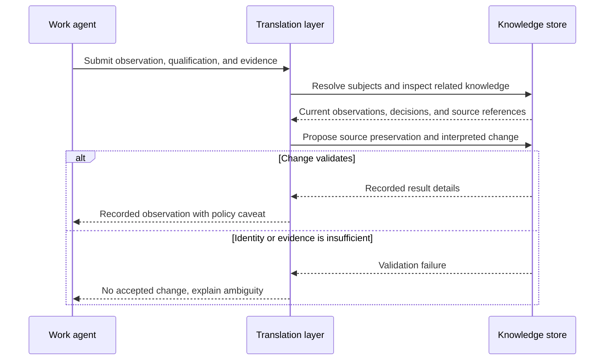
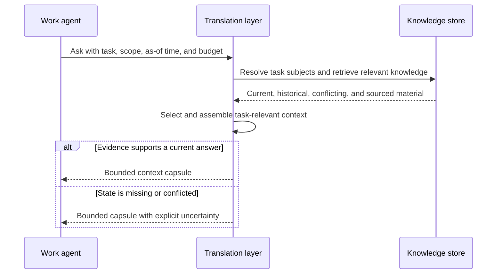
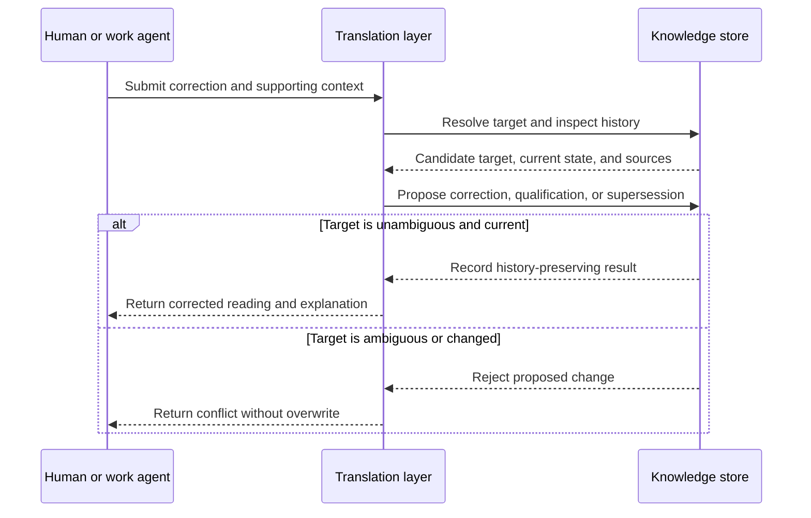
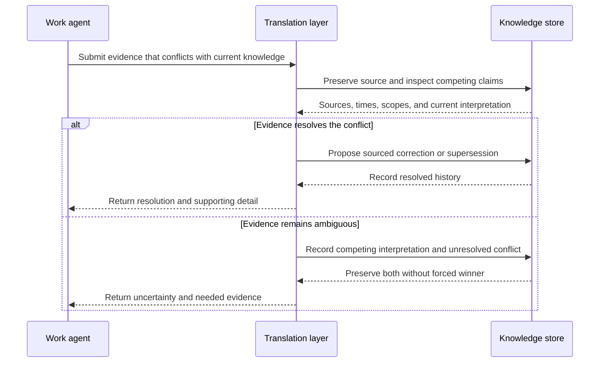
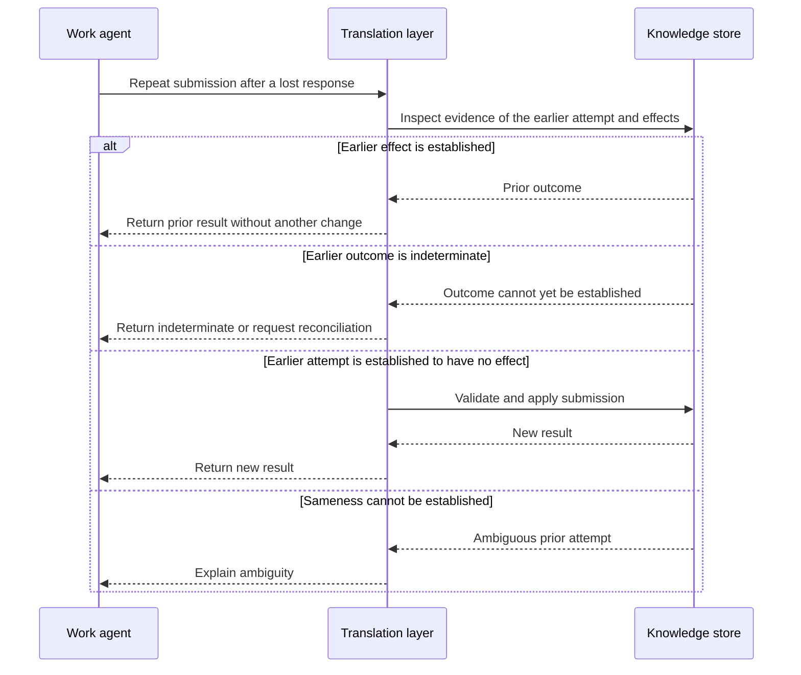
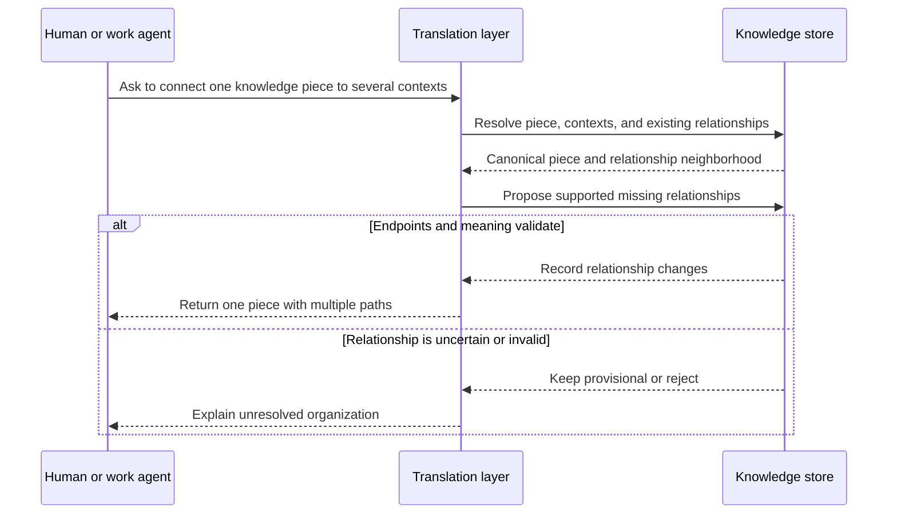
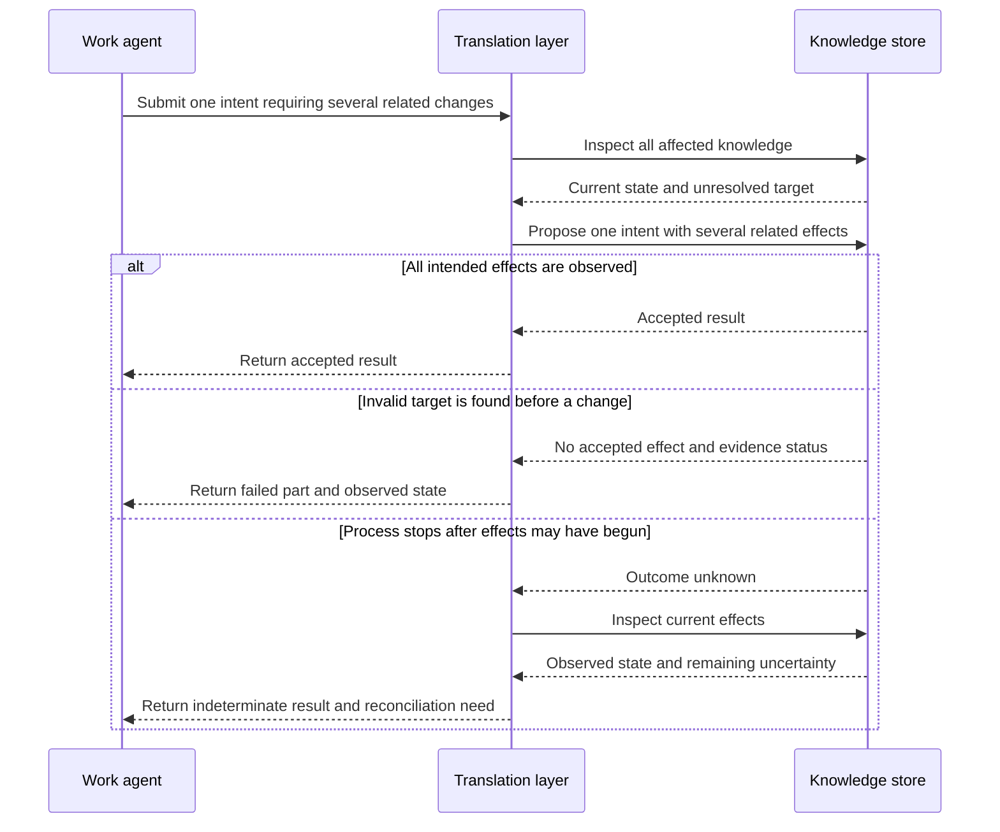
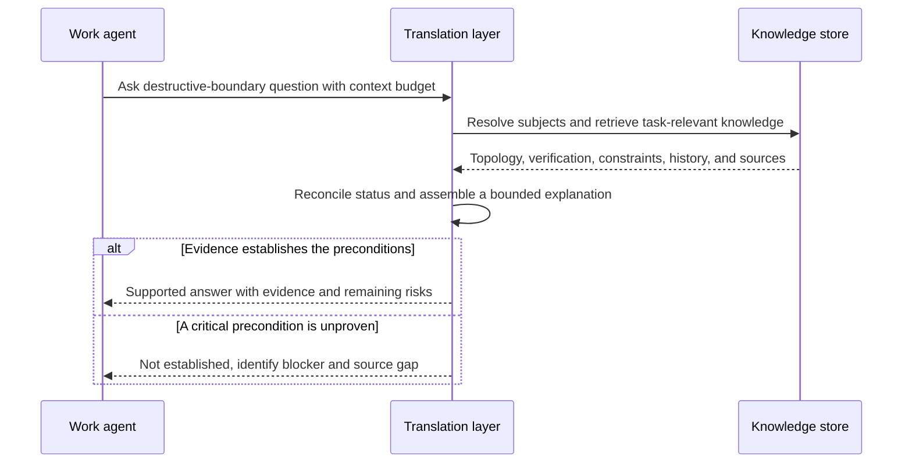

# Workflow catalog

These stories name behavior to pressure-test before choosing an architecture. They are not executable simulations: the original versions hid the difficult information dependencies inside verbs such as “resolve,” “retrieve,” “interpret,” and “assemble.” The [candidate interaction traces](interaction-traces.md) now expand every story into explicit left/right payloads, reasoning prerequisites, durable effects, and feasibility limits. The [information-flow model](information-flow.md) explains the shared boundary.

Every step and expected result below remains a starting hypothesis. Nothing here selects a database, schema, ontology, API, or permanent name for the internal layer.

References such as `T055` point to the stable entries in the [verbatim origin conversation](../source/origin-conversation-verbatim.md).

The participants are deliberately generic:

- **Work agent:** investigates, operates, or plans in the outside world.
- **Translation layer:** a short-lived, bounded interpreter for knowledge reads and writes.
- **Knowledge store:** durable source material, interpreted knowledge, links, history, and store-side enforcement.

The diagrams are interaction flows, not a proposed component diagram. The transcript asks for this behavior-first sequence in `T055–T061` and for explicit simulations before design in `T061`.

## 1. Ingest and store an N5 observation

**Input**

- A work agent reports authenticated output showing `zfs_arc_max=2147483648` on N5.
- It states that this is observed configuration, not an accepted permanent sizing decision.
- The submission includes the evidence, its source, and observation time.

**Steps**

1. The work agent submits the evidence and its plain-language meaning. It does not construct records or links.
2. The translation layer resolves N5, ARC, the observed value, and the distinction between live configuration and policy.
3. It inspects related current knowledge and any earlier statement that treated 2 GiB as settled.
4. It proposes a bounded change that preserves the source, records the observation, and keeps the policy qualification attached.
5. The knowledge store evaluates the proposed change and either records it or explains why it cannot.
6. The translation layer returns a result explaining what was recorded and what was not promoted to a decision.

**Expected result**

- A later retrieval can report both the observed 2 GiB value and the fact that its long-term suitability remains undecided. The original evidence remains traceable.

**Key failure variant**

- If “N5” cannot be resolved or the evidence lacks enough provenance, no current operational fact is silently invented. The response identifies the ambiguity and what would resolve it.

Transcript basis: `T040–T042`, `T055–T061`.

## 2. Retrieve bounded context for a task

**Input**

- A work agent asks: “I am diagnosing N5 disk activity. Give me the current storage topology, active safety constraints, and unfinished operations.”
- The request includes task scope, an as-of time, and a context budget.

**Steps**

1. The translation layer interprets the task rather than treating the request as a keyword search.
2. It resolves N5 and retrieves relevant topology, observations, decisions, constraints, operations, conflicts, and source references.
3. It prefers the knowledge relevant to this task and time instead of returning the whole neighborhood or every stored field.
4. It assembles a compact explanation with operational identifiers and provenance only where useful.
5. It returns the context capsule and ends the invocation.

**Expected result**

- The work agent receives enough current context to investigate safely without learning graph queries, storage shapes, or mutation rules.

**Key failure variant**

- If current state is missing, stale, or contradictory, the capsule says so and names the unresolved evidence instead of filling the gap with a confident answer.

Transcript basis: `T046–T052`, `T055–T060`.

## 3. Correct or supersede an earlier belief

**Input**

- A human or work agent states: “The 2 GiB ARC cap is live configuration. It is not an accepted hardware requirement.”
- The submission identifies the earlier belief if known and includes supporting context.

**Steps**

1. The translation layer resolves the correction target and retrieves its history and sources.
2. It distinguishes a correction, a qualification, and a newly observed change.
3. It preserves the earlier statement and proposes the smallest relationship between old and new meanings: replacement, qualification, or coexistence.
4. Before applying the correction, the knowledge store exposes whether the target still matches what the layer interpreted.
5. On success, it records the new interpretation and its relationship to the old one without erasing history.
6. The translation layer returns the new current reading and an explanation of the history change.

**Expected result**

- Retrieval no longer presents “configured at 2 GiB” as proof that “2 GiB is the accepted requirement,” while an audit can still explain how the mistaken reading arose.

**Key failure variant**

- If several earlier claims could be the target, or the target changed concurrently, the layer returns the candidates or conflict rather than overwriting one by guesswork.

Transcript basis: `T040–T042`, `T050`, `T055–T061`.

## 4. Preserve ambiguity or conflicting evidence

**Input**

- Two credible sources disagree about whether the fourth N5 disk is still an independent migration source or has already joined the pool.

**Steps**

1. The translation layer preserves both submissions and resolves the entities each source appears to describe.
2. It compares source time, scope, directness, and the claims already treated as current.
3. If the evidence cannot settle the question, it represents both interpretations and the conflict between them.
4. It records what observation could resolve the conflict, without assigning that work to itself.
5. A read request receives the conflict and its operational consequence: do not assume the independent copy exists.

**Expected result**

- Useful but unresolved evidence remains available. Neither source is discarded merely because it does not fit a single current story.

**Key failure variant**

- If the translation layer proposes one winner without sufficient evidence, store-side validation or review leaves the conflict unresolved and reports the unsupported conclusion.

Transcript basis: `T022–T024`, `T046–T052`, `T055–T061`.

## 5. Retry the same submission safely

**Input**

- A work agent retries the same N5 observation because its first response timed out.
- The available evidence suggests this is a repeat of the earlier attempt; the simulations still need to discover how sameness can be established.

**Steps**

1. The translation layer receives the repeat as a clean invocation.
2. It inspects whatever durable evidence exists about the earlier attempt, its content, and its effects.
3. If the earlier effect is established, it returns that outcome without creating another source, fact, or link.
4. If the earlier outcome is unknown, it reports that uncertainty or reconciles it before applying anything new.
5. It treats the submission as new only when the available evidence establishes that the earlier attempt had no effect.
6. If the layer cannot establish that the content is the same, it exposes the ambiguity instead of guessing.

**Expected result**

- Network retries do not multiply knowledge or change meaning, and the work agent receives a stable outcome.

**Key failure variant**

- The trace exposes which evidence, identity, or stored outcome made the repeat recognizable. If none is sufficient, that limitation remains visible rather than being filled in with an invented mechanism.

Transcript basis: `T057–T060`.

## 6. Link and reorganize knowledge across contexts

**Input**

- An existing fact about `tank` is relevant to N5, the storage domain, RAIDZ migration, and inference-resource planning.
- A human or work agent asks to make those relationships discoverable without copying the fact.

**Steps**

1. The translation layer resolves the existing knowledge piece and each requested context.
2. It inspects current relationships and checks whether the request is asserting a relationship or merely suggesting one.
3. It proposes only missing, supported relationships; the underlying content remains one durable piece.
4. The knowledge store validates the endpoints and applies the organizational change.
5. Retrieval through any linked context can now discover the same knowledge and provenance.

**Expected result**

- Reorganization changes how knowledge is found, not how many copies of the statement exist. Agents can approach the same material from host, domain, operation, or planning contexts.

**Key failure variant**

- An uncertain inferred relationship remains visibly provisional or uncommitted; it does not silently become an accepted link.

Transcript basis: `T043–T048`, `T051–T052`, `T055–T061`.

## 7. Explore an invalid or partial mutation

**Input**

- One submission asks to record an observation, supersede an older statement, and link the result to a migration operation.
- The observation is interpretable, but the proposed operation target cannot be resolved.

**Steps**

1. The translation layer interprets the whole request and inspects every affected item.
2. It describes the intended combined result and the changes that might occur along the way.
3. The knowledge store exposes that the operation target cannot be resolved.
4. The trace records which, if any, changes became visible and whether the original evidence was retained.
5. The response identifies the failed part and the observed state instead of implying that the whole request succeeded or failed uniformly.

**Expected result**

- A failed multi-step interpretation leaves an explicit, inspectable account of what changed, what did not, and what remains unknown. The traces decide whether all-or-nothing behavior is required.

**Key failure variant**

- If the process stops after changes may have begun, the result remains indeterminate until inspection establishes the current state.

Transcript basis: `T055–T061`.

## 8. Assemble task-specific context from stored pieces

**Input**

- A work agent asks: “Can the fourth disk now be erased and added to `tank`?”
- It asks for the answer, blockers, and supporting evidence within a bounded context size.

**Steps**

1. The translation layer resolves the disk, pool, migration, verification attempt, and destructive boundary.
2. It retrieves current and superseded observations, relevant safety constraints, the verification result, and the source evidence behind each.
3. It recognizes that a completed read is not equivalent to retained successful verification when output or exit status is missing.
4. It assembles a task-specific narrative: current topology, what is known, what remains unproven, and why erasure is or is not supported.
5. It returns the answer and compact citations without storing the generated narrative as a new canonical document.

**Expected result**

- The work agent receives a coherent operational explanation assembled from reusable knowledge pieces, without raw front matter or an entire repository dump.

**Key failure variant**

- If verification completion is unknown, the answer remains “not established” even when an older plan or partial progress estimate implies an expected finish time has passed.

Transcript basis: `T013–T024`, `T043–T052`, `T055–T061`.

## Questions these workflows leave open

- Is raw evidence retained independently when its interpretation fails?
- What distinguishes an accepted relationship from a useful inferred one?
- Which submissions need explicit human acceptance, and which can record direct observations immediately?
- What makes two retries the same: caller identity, supplied identity, evidence content, or some combination?
- How are conflicts declared resolved without losing the competing source history?
- How much provenance belongs in a normal context capsule versus an on-demand audit response?

These are inputs to the simulation harness. They are not decisions hidden inside these examples.
